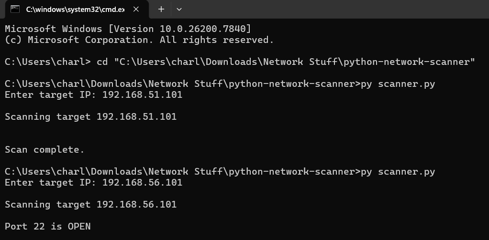

# Python Network Scanner

This project is a simple Python-based network scanner that detects open ports on a target system.

## How It Works

The script uses Python's socket library to attempt connections to ports on a target machine.  
If the connection succeeds, the port is reported as open.

## Usage

Run the scanner:

py scanner.py

Enter the target IP address when prompted.

## Example Output

## Skills Demonstrated

- Python programming
- Network socket communication
- Port scanning fundamentals
- Cybersecurity reconnaissance techniques
